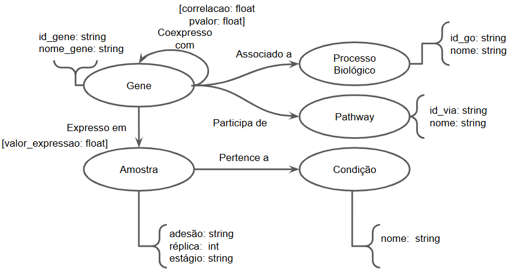

# Análise de Coexpressão Gênica em Schistosoma mansoni

# Gene Coexpression Analysis in Schistosoma mansoni

## Descrição do Projeto

Este projeto investiga padrões de expressão gênica em amostras de *Schistosoma mansoni* utilizando dados de RNA-seq, com foco na identificação de relações entre genes e na construção futura de redes de coexpressão. A análise busca compreender diferenças entre amostras em termos de perfil transcriptômico e preparar uma base sólida para modelagem baseada em grafos.

Slides da apresentação:  
[link vai aqui]

---

## Fundamentação Teórica

A análise de dados de RNA-seq permite quantificar a expressão gênica em larga escala, possibilitando a identificação de padrões biológicos relevantes. A modelagem de coexpressão gênica representa genes como nós em uma rede, conectados por relações baseadas em similaridade de expressão, permitindo a identificação de módulos funcionais, genes centrais e estruturas associadas a processos biológicos.

---

## Perguntas de Pesquisa

- Existem diferenças estruturais nos perfis de expressão entre as amostras analisadas?
- É possível identificar genes com comportamento diferencial significativo?
- Os dados apresentam estrutura suficiente para construção de redes de coexpressão?
- Como essas relações podem ser representadas em forma de grafo?

---

## Metodologia

O pipeline de análise consistiu nas seguintes etapas:

Inicialmente, foi realizado o controle de qualidade dos dados brutos utilizando FastQC. Em seguida, as leituras passaram por um processo de limpeza com Trimmomatic, removendo adaptadores e regiões de baixa qualidade. Uma nova análise com FastQC foi realizada após o trimming para validação dos dados processados.

A quantificação da expressão gênica foi realizada com Salmon, utilizando um transcriptoma de referência de *Schistosoma mansoni*. A partir disso, foram geradas matrizes de expressão em TPM e contagens estimadas de leituras.

As análises subsequentes foram conduzidas em R, incluindo transformação logarítmica dos dados, cálculo de correlação entre amostras, análise de componentes principais (PCA), clustering hierárquico e geração de heatmaps com genes mais variáveis. Por fim, foi realizada uma análise diferencial exploratória comparando uma amostra específica com as demais.

---

## Bases de Dados e Evolução

Foram utilizadas seis amostras de RNA-seq provenientes do SRA:

- SRR1140763  
- SRR1140994  
- SRR1140995  
- SRR1142421  
- SRR1142422  
- SRR1142423  

Os dados foram obtidos no formato FASTQ e submetidos a um pipeline completo de processamento. Durante a análise, observou-se que a amostra SRR1140763 apresentou baixa taxa de mapeamento (~7%), indicando possível limitação técnica, enquanto as demais amostras apresentaram taxas mais consistentes.

Os dados evoluíram de sequências brutas para matrizes estruturadas de expressão gênica, permitindo análises estatísticas e identificação de padrões.

---

## Modelo Lógico

O modelo conceitual do projeto considera:

- Genes como nós principais
- Amostras como entidades associadas
- Relações de coexpressão como arestas
- Possível integração com vias biológicas e processos funcionais

A construção dessas relações permitirá a análise de conectividade, modularidade e centralidade em redes gênicas.

> 

---

## Integração entre Bases

A integração ocorre entre:  

- Dados de expressão gênica (RNA-seq)  
- Transcriptoma de referência  
- Estruturas derivadas (matrizes e correlações)   

Essa integração permite transformar dados brutos em representações estruturadas, adequadas para modelagem em grafos.

---

## Análise Preliminar

Os resultados iniciais indicam alta correlação entre as amostras, com valores superiores a 0.92, sugerindo consistência global nos dados. No entanto, análises de PCA e clustering revelaram a presença de heterogeneidade, com destaque para a amostra SRR1142421, que apresentou um perfil distinto em relação às demais.

A análise de genes mais variáveis e a análise diferencial exploratória identificaram genes fortemente induzidos e reprimidos, reforçando a existência de diferenças biológicas relevantes. A amostra SRR1140763, apesar de incluída na análise, apresentou comportamento potencialmente influenciado por fatores técnicos.

---

## Evolução do Projeto

O projeto evoluiu de um plano teórico para a execução completa de um pipeline de RNA-seq, incluindo processamento, quantificação e análise exploratória. Foram obtidos resultados consistentes que indicam a presença de estrutura nos dados e justificam a continuidade da pesquisa.

A próxima etapa consiste na construção de redes de coexpressão gênica, identificação de módulos e análise de propriedades topológicas, alinhando-se ao objetivo principal de modelagem baseada em grafos.

---

## Ferramentas Utilizadas

- FastQC  
- Trimmomatic  
- Salmon  
- Python  
- R  

---

## Referências Bibliográficas

## Referências Bibliográficas

[1] ANDREWS, S. *FastQC: A Quality Control Tool for High Throughput Sequence Data*. 2010. Disponível em: <http://www.bioinformatics.babraham.ac.uk/projects/fastqc>. Acesso em: 15 abr. 2026.

[2] EWELS, P.; MAGNUSSON, M.; LUNDIN, S.; KÄLLER, M. MultiQC: summarize analysis results for multiple tools and samples in a single report. *Bioinformatics*, v. 32, n. 19, p. 3047–3048, 2016. DOI: <http://dx.doi.org/10.1093/bioinformatics/btw354>.

[3] BOLGER, A. M.; LOHSE, M.; USADEL, B. Trimmomatic: a flexible trimmer for Illumina sequence data. *Bioinformatics*, v. 30, n. 15, p. 2114–2120, 2014. DOI: <https://doi.org/10.1093/bioinformatics/btu170>.

[4] PATRO, R.; DUGGAL, G.; LOVE, M. I.; IRIZARRY, R. A.; KINGSFORD, C. Salmon provides fast and bias-aware quantification of transcript expression. *Nature Methods*, v. 14, n. 4, p. 417–419, 2017. DOI: <http://dx.doi.org/10.1038/nmeth.4197>.

[5] MCMANUS, D. P.; DUNNE, D. W.; SACKO, M.; UTZINGER, J.; VENNERVALD, B. J.; ZHOU, X. N. Schistosomiasis. *Nature Reviews Disease Primers*, v. 4, p. 13, 2018.