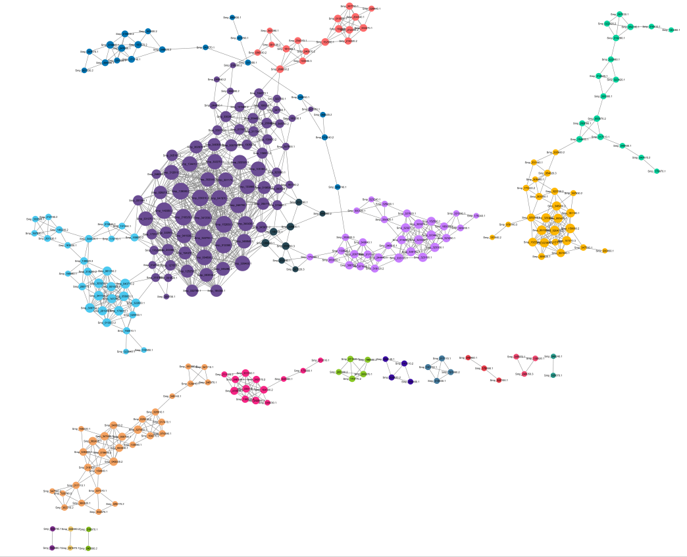
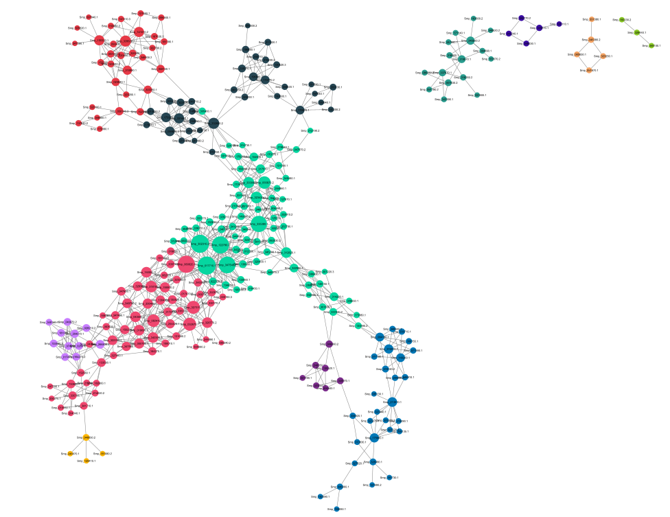

# Projeto Análise de Redes de Coexpressão em Cercárias de *Schistosoma mansoni*

# Project Co-expression Network Analysis in *Schistosoma mansoni* Cercariae

# Descrição Resumida do Projeto

Este projeto investigou padrões de expressão e coexpressão gênica em cercárias de *Schistosoma mansoni*, comparando amostras associadas a interações simpátricas e alopátricas com o hospedeiro intermediário. A proposta foi transformar dados públicos de RNA-seq em redes de coexpressão, explorar visualmente sua organização no Cytoscape e identificar módulos, hubs e genes candidatos biologicamente relevantes.

O foco biológico da análise foi investigar se cercárias provenientes de interações simpátricas e alopátricas apresentam sinais distintos de organização transcriptômica. Em vez de analisar apenas genes isolados, a abordagem por redes permitiu observar conjuntos de genes com padrões coordenados ou opostos de expressão, buscando módulos que pudessem estar associados à fisiologia da cercária, à interação parasita-hospedeiro, à secreção, à membrana, à proteólise e à regulação molecular.

Após o controle de qualidade, a geração 1 foi excluída da análise principal por critério de qualidade, devido à contaminação identificada na amostra alopátrica SRR1142421. Para manter o pareamento, a amostra simpátrica correspondente também foi excluída. A análise final foi conduzida com as gerações 2 e 3.

A rede foi separada em duas camadas: uma rede positiva, representando genes positivamente coexpressos, e uma rede negativa, representando genes anticorrelacionados. As comunidades foram detectadas no Cytoscape com GLay. Em seguida, as comunidades foram interpretadas a partir de métricas de conectividade, presença de hubs, diferença média pareada entre alopátrico e simpático e anotação funcional dos genes prioritários.

# Slides

[Apresentação final em PDF](assets/slides/ApresentaçãoFinal_20261.pdf)

# Fundamentação Teórica

O estudo parte da ideia de que interações parasita-hospedeiro podem estar associadas a alterações transcriptômicas em organismos parasitários. Em *Schistosoma mansoni*, cercárias representam um estágio relevante do ciclo de vida, pois são as formas infectantes liberadas pelo hospedeiro intermediário no ambiente aquático e responsáveis pela infecção do hospedeiro definitivo.

Biologicamente, a cercária é uma fase curta, móvel e especializada. Ela precisa manter atividade metabólica, nadar, responder ao ambiente, preservar estruturas de superfície, secretar moléculas e iniciar processos associados à penetração e à transformação em esquistossômulo. Por isso, módulos de genes associados a energia, membrana, secreção, proteólise, sinalização e interação com o hospedeiro são especialmente relevantes para interpretar a biologia dessa fase.

A análise de redes de coexpressão permite observar não apenas genes isolados, mas módulos de genes com padrões coordenados ou opostos de expressão. Genes em um mesmo módulo podem representar processos celulares organizados de forma conjunta. Já genes em redes negativas podem sugerir relações de oposição entre processos biológicos.

# Perguntas de Pesquisa

Pergunta principal: A interação simpátrica entre *Schistosoma mansoni* e seu hospedeiro intermediário está associada a padrões distintos de coexpressão gênica nas cercárias, em comparação com interações alopátricas?

Perguntas secundárias:

1. Quais genes apresentam padrões de coexpressão mais característicos em cercárias provenientes de interações simpátricas e alopátricas?
2. Existem módulos ou agrupamentos de genes coexpressos que diferenciam as duas condições experimentais?
3. Há diferenças na organização global das redes de coexpressão gênica entre cercárias simpátricas e alopátricas, considerando propriedades como conectividade e centralidade?
4. Os módulos centrais da rede apresentam direção média de expressão distinta entre alopátrico e simpático?
5. Os genes mais conectados da rede estão associados a funções biologicamente relevantes para a cercária, como secreção, membrana, regulação ou interação com o hospedeiro?

# Metodologia

A análise final utilizou amostras das gerações 2 e 3. A matriz TPM foi transformada por `log2(TPM + 1)`. Em seguida, foram selecionados genes/transcritos variáveis e calculadas correlações gene-gene.

Foram construídas duas redes:

* rede positiva: correlações positivas fortes;
* rede negativa: correlações negativas fortes.

Os arquivos de nós e arestas foram importados no Cytoscape. As comunidades foram detectadas com GLay. Em seguida, cada comunidade foi avaliada por conectividade, hubs, grau médio, anotação funcional e diferença média pareada entre alopátrico e simpático.

A diferença média pareada foi usada para resumir a direção da expressão entre condições, respeitando a comparação por geração. Para cada gene, foram calculadas as diferenças:

* geração 2: alopátrico 2 menos simpático 2;
* geração 3: alopátrico 3 menos simpático 3.

Em seguida, essas duas diferenças foram resumidas em um delta médio pareado. Valores positivos indicam maior expressão média em alopátrico. Valores negativos indicam maior expressão média em simpático. Valores próximos de zero indicam pouca diferença média entre as condições.

Essa abordagem permitiu integrar três níveis de informação:

1. estrutura da rede;
2. direção da expressão entre condições;
3. anotação funcional dos genes prioritários.

## Bases de Dados e Evolução

| Base                                      | Endereço                                | Uso                                       |
| ----------------------------------------- | --------------------------------------- | ----------------------------------------- |
| SRA/ENA - SRP035609                       | NCBI/ENA                                | dados públicos de RNA-seq                 |
| Referência *S. mansoni* PRJEA36577/WBPS19 | WormBase ParaSite/arquivo de referência | quantificação transcriptômica com Salmon  |
| UniProt                                   | https://www.uniprot.org/                | anotação funcional dos genes prioritários |

## Modelo Lógico

Modelo conceitual usado no projeto:

* Amostra possui condição;
* Amostra possui geração;
* Gene/transcrito é expresso em amostra;
* Gene/transcrito se conecta a outro gene/transcrito por correlação;
* Gene/transcrito pertence a comunidade GLay;
* Gene/transcrito possui métricas de centralidade;
* Gene/transcrito possui anotação funcional;
* Gene/transcrito possui direção média de expressão entre alopátrico e simpático.

## Integração entre Bases

A integração principal ocorreu em três níveis: metadados das amostras, matriz de expressão e anotação funcional. Os IDs de genes/transcritos provenientes do Salmon foram usados para construir redes e, posteriormente, buscar anotações no UniProt. Os metadados permitiram classificar as amostras como simpátricas ou alopátricas e separar as gerações usadas na análise final.

Além disso, os dados de expressão transformados foram integrados às métricas de rede para avaliar se genes centrais e módulos específicos apresentavam tendência de maior expressão em alopátrico ou simpático. Essa integração foi importante para transformar a rede em uma análise biologicamente interpretável.

## Redes de Coexpressão

### Rede Positiva

A rede positiva representa genes com correlação positiva forte, indicando padrões coordenados de expressão. Nessa rede, genes conectados tendem a aumentar ou diminuir juntos entre as amostras. Por isso, ela foi tratada como a principal rede de coexpressão.

Biologicamente, a rede positiva permite identificar módulos de genes que podem estar participando de processos coordenados, como regulação molecular, metabolismo, secreção, manutenção de membrana ou interação com o hospedeiro.

### Rede Negativa

A rede negativa representa genes anticorrelacionados, indicando padrões opostos de expressão. Nessa rede, quando um gene tende a apresentar maior expressão, o outro tende a apresentar menor expressão.

Biologicamente, a rede negativa foi interpretada como uma análise complementar de anticorrelação. Ela pode sugerir oposição entre programas celulares, alternância entre estados fisiológicos ou relações inversas entre processos associados a membrana, sinalização, proteólise, tráfego vesicular ou metabolismo.

# Análises Realizadas

As principais análises foram:

1. montagem da matriz TPM e NumReads;
2. exclusão da geração 1 por critério de qualidade;
3. transformação da expressão por `log2(TPM + 1)`;
4. construção de redes positiva e negativa;
5. detecção visual de comunidades com GLay no Cytoscape;
6. identificação de hubs e módulos centrais;
7. cálculo da diferença média pareada entre alopátrico e simpático;
8. anotação funcional dos genes prioritários;
9. análise integrada de centralidade, conectividade, direção da expressão e interpretação biológica.

# Evolução do Projeto

O projeto evoluiu de uma análise inicial de expressão para uma abordagem de redes e visualização. Após o controle de qualidade, a geração 1 foi excluída da análise principal, tornando a abordagem mais conservadora. Também foi decidido separar correlações positivas e negativas, evitando misturar genes com comportamento coordenado e genes com comportamento inverso em uma única rede.

Na etapa final, a análise passou a integrar métricas de centralidade, comunidades GLay, direção média de expressão entre condições e anotação funcional. Essa integração permitiu interpretar as redes não apenas como estruturas visuais, mas como possíveis representações de programas biológicos organizados nas cercárias.

# Ferramentas

Foram usadas:

* FastQC e Trimmomatic nas etapas iniciais de qualidade;
* Salmon para quantificação transcriptômica;
* Python para manipulação de matrizes, construção das redes e síntese dos resultados;
* Cytoscape para visualização e detecção de comunidades com GLay;
* UniProt para anotação funcional.

# Resultados

Na rede positiva, o principal módulo foi a GLay 16, com 75 genes, 20 hubs e delta médio pareado positivo em alopátrico. Essa comunidade concentrou o núcleo central da rede positiva.

Esse resultado é relevante porque indica que os genes mais conectados da rede positiva não estavam distribuídos aleatoriamente entre vários módulos, mas concentrados em uma única comunidade. Além disso, a direção média da expressão sugere maior atividade desse núcleo em amostras alopátricas.

A GLay 16 reuniu genes associados a temas como regulação gênica, metabolismo/energia, lipídios/membrana, secreção/interação com o hospedeiro e genes não caracterizados. Entre os genes de destaque estão:

* `Smp_322700.1`: proteína com domínio WD-repeat, possivelmente associada a interação proteína-proteína, organização de complexos moleculares ou regulação celular;
* `Smp_152630.1`: MEG-12, pertencente à família dos micro-exon genes, frequentemente associada a proteínas secretadas e à interface parasita-hospedeiro;
* `Smp_012350.1`: Venom allergen-like VAL11, associado a uma família de proteínas frequente em helmintos, relacionada a secreção, tegumento, glândulas ou interação com o hospedeiro;
* `Smp_210520.2`: Tyrosyl-DNA phosphodiesterase, relacionada a processamento molecular, manutenção ou reparo de DNA;
* `Smp_149380.2`: proteína com domínio SET, sugerindo possível relação com regulação transcricional ou epigenética.

Outras comunidades positivas relevantes foram GLay 12, associada a proteínas secretadas, GLay 14, associada a secreção e proteólise, GLay 15, com sinal alopátrico forte, e GLay 3, com direção simpátrica forte.

A GLay 12 apresentou uma assinatura funcional mais específica, com genes associados a secreção. Esse módulo é biologicamente relevante porque proteínas secretadas podem atuar na comunicação com o ambiente, na interação parasita-hospedeiro e em processos relacionados ao estabelecimento da infecção.

A GLay 14 sugeriu uma associação entre secreção e proteólise. Essa combinação é interessante para a biologia de parasitas, pois processos proteolíticos podem estar relacionados ao processamento de proteínas, modificação do ambiente, degradação de barreiras ou interação com tecidos do hospedeiro.

Na rede negativa, as comunidades GLay 5 e GLay 6 concentraram os principais hubs de anticorrelação. Essas comunidades indicaram relações inversas envolvendo genes associados a membrana, tráfego vesicular, glicosilação, proteólise, sinalização, metabolismo e processamento molecular.

# Interpretação Biológica dos Achados

O principal achado biológico sobre as cercárias analisadas sugere que apresentam uma organização transcriptômica modular compatível com sua função como estágio infectante. Os módulos detectados não foram definidos previamente por função. Eles emergiram a partir dos padrões de correlação entre genes. Posteriormente, a anotação funcional mostrou que alguns desses módulos reuniam genes associados a processos biologicamente coerentes.

A GLay 16 foi o achado mais relevante da rede positiva. Por concentrar os hubs e apresentar maior atividade média em alopátrico, ela sugere que genes centrais da rede podem estar mais ativos em cercárias provenientes de interações alopátricas. Essa comunidade pode representar um núcleo fisiológico associado à manutenção e preparação da cercária, envolvendo regulação, metabolismo energético, membrana, secreção e interação com o hospedeiro.

Essa interpretação é biologicamente interessante porque a condição alopátrica representa uma interação entre parasita e hospedeiro intermediário de origens diferentes. O maior sinal alopátrico na GLay 16 pode indicar que cercárias produzidas nesse contexto apresentam maior atividade de um conjunto central de genes ligados à fisiologia celular e à interface com o hospedeiro. Essa hipótese é exploratória, mas aponta para uma possível resposta transcriptômica associada à interação não local.

A presença de genes como MEG-12 e VAL11 na GLay 16 reforça a leitura de que esse módulo pode estar relacionado à interface parasita-hospedeiro. MEGs e VALs são famílias relevantes em helmintos e frequentemente associadas a secreção, superfície, glândulas, variação molecular ou interação com o hospedeiro. No entanto, a função específica desses genes neste conjunto de amostras ainda precisa ser validada.

A GLay 12, com maior direção simpática, sugere que alguns módulos associados a secreção podem estar relativamente mais ativos em cercárias simpátricas. Isso pode ser biologicamente interessante porque interações simpátricas, por envolverem parasita e hospedeiro intermediário de mesma origem geográfica, poderiam preservar padrões moleculares mais ajustados à interação local. Porém, essa interpretação deve ser tratada com cautela, devido ao número reduzido de amostras.

A GLay 14, associada a secreção e proteólise, sugere a coexpressão de genes envolvidos em processos potencialmente ligados à interação ativa da cercária com o ambiente ou com o hospedeiro. A combinação entre secreção e proteólise é coerente com processos parasitários, pois pode envolver liberação de moléculas, processamento proteico e modificação de barreiras ou substratos biológicos.

As GLay 5 e GLay 6 da rede negativa indicam que também existem relações organizadas de oposição entre genes. Isso sugere que a biologia das cercárias pode envolver não apenas ativação coordenada de módulos, mas também equilíbrio entre programas celulares opostos. Esses módulos negativos podem representar relações inversas entre processos de membrana, sinalização, tráfego vesicular, proteólise e metabolismo.

Em conjunto, os achados sugerem que as diferenças entre alopátrico e simpático não aparecem como uma separação simples e global de toda a rede. Em vez disso, os sinais parecem distribuídos de forma heterogênea entre módulos. Alguns módulos, como GLay 16 e GLay 15, apresentaram direção alopátrica; outros, como GLay 12 e GLay 3, apresentaram direção simpática. Isso sugere que a resposta transcriptômica pode ser modular, com diferentes blocos gênicos respondendo de forma distinta às condições biológicas analisadas.

# Discussão

A análise não permite afirmar de forma definitiva que as condições simpátrica e alopátrica possuem redes globalmente distintas, devido ao número reduzido de amostras após o controle de qualidade. Porém, a abordagem integrada de visualização, centralidade, direção de expressão e anotação funcional permitiu identificar módulos candidatos.

O achado mais forte foi que a GLay 16, principal núcleo de coexpressão positiva, concentrou todos os hubs e apresentou maior atividade média na condição alopátrica. Esse resultado sugere que genes centrais associados a regulação, energia, membrana e secreção/interação podem estar mais ativos em cercárias alopátricas.

A interpretação biológica desse achado é que a condição alopátrica pode estar associada à maior atividade de um módulo central da fisiologia da cercária. Isso pode refletir diferenças na interação parasita-hospedeiro intermediário quando as origens geográficas não são compartilhadas. No entanto, essa possibilidade deve ser considerada como hipótese gerada pela rede, não como conclusão definitiva.

Além disso, módulos secundários apresentaram direções diferentes, indicando que a diferença entre condições não é global e uniforme, mas distribuída de forma heterogênea entre módulos. A GLay 12 e a GLay 14 foram particularmente relevantes por apresentarem assinaturas funcionais associadas a secreção e proteólise, processos importantes para a biologia de parasitas e para a interface parasita-hospedeiro.

Na rede negativa, as GLay 5 e GLay 6 mostraram que há relações inversas estruturadas entre genes associados a membrana, sinalização, tráfego vesicular, proteólise e metabolismo. Isso sugere que parte da organização transcriptômica das cercárias pode envolver oposição entre programas celulares, e não apenas coexpressão positiva.

# Conclusão

O projeto mostrou que a combinação de RNA-seq, redes de coexpressão, Cytoscape/GLay e anotação funcional permite identificar módulos e genes candidatos em dados transcriptômicos de *Schistosoma mansoni*. A análise final foi conservadora e exploratória, mas revelou um núcleo central de coexpressão positiva, módulos associados a proteínas secretadas e módulos de anticorrelação funcionalmente relevantes.

A principal contribuição biológica foi mostrar que a expressão gênica das cercárias parece organizada em módulos compatíveis com processos relevantes para sua função como estágio infectante, incluindo regulação molecular, metabolismo energético, membrana, secreção, proteólise e interação com o hospedeiro.

A GLay 16 se destacou como o principal núcleo da rede positiva, concentrando os hubs e apresentando maior direção média em alopátrico. Esse resultado sugere que cercárias provenientes da condição alopátrica podem apresentar maior atividade de um módulo central associado à fisiologia e à interface parasita-hospedeiro.

Por outro lado, módulos como GLay 12 e GLay 3 apresentaram direção simpática, indicando que os sinais entre condições não são uniformes. Assim, a diferença entre alopátrico e simpático parece ocorrer de forma modular, com diferentes conjuntos de genes apresentando padrões distintos de atividade.

Portanto, os resultados não confirmam de forma definitiva uma reorganização global da rede entre condições, mas indicam módulos e genes candidatos para estudos futuros. Esses achados geram hipóteses sobre como interações simpátricas e alopátricas podem influenciar a organização transcriptômica das cercárias de *S. mansoni*.

# Trabalhos Futuros

Como próximos passos, seria importante:

* aumentar o número de amostras por condição;
* validar os módulos em outros conjuntos de dados;
* realizar análise diferencial formal com contagens;
* usar bases específicas como WormBase ParaSite quando disponíveis;
* fazer enriquecimento funcional formal;
* comparar redes independentes por condição com maior número de réplicas;
* testar se os módulos com direção alopátrica e simpática são reproduzíveis em outros experimentos;
* investigar de forma específica genes das famílias MEG e VAL;
* avaliar se módulos associados a secreção, proteólise e membrana apresentam relação com infectividade, desenvolvimento ou interação parasita-hospedeiro.

# Referências Bibliográficas

[1] ANDREWS, S. *FastQC: A Quality Control Tool for High Throughput Sequence Data*. 2010. Disponível em: http://www.bioinformatics.babraham.ac.uk/projects/fastqc. Acesso em: 15 abr. 2026.

[2] EWELS, P.; MAGNUSSON, M.; LUNDIN, S.; KÄLLER, M. MultiQC: summarize analysis results for multiple tools and samples in a single report. *Bioinformatics*, v. 32, n. 19, p. 3047–3048, 2016. DOI: http://dx.doi.org/10.1093/bioinformatics/btw354.

[3] BOLGER, A. M.; LOHSE, M.; USADEL, B. Trimmomatic: a flexible trimmer for Illumina sequence data. *Bioinformatics*, v. 30, n. 15, p. 2114–2120, 2014. DOI: https://doi.org/10.1093/bioinformatics/btu170.

[4] PATRO, R.; DUGGAL, G.; LOVE, M. I.; IRIZARRY, R. A.; KINGSFORD, C. Salmon provides fast and bias-aware quantification of transcript expression. *Nature Methods*, v. 14, n. 4, p. 417–419, 2017. DOI: http://dx.doi.org/10.1038/nmeth.4197.

[5] MCMANUS, D. P.; DUNNE, D. W.; SACKO, M.; UTZINGER, J.; VENNERVALD, B. J.; ZHOU, X. N. Schistosomiasis. *Nature Reviews Disease Primers*, v. 4, p. 13, 2018.
